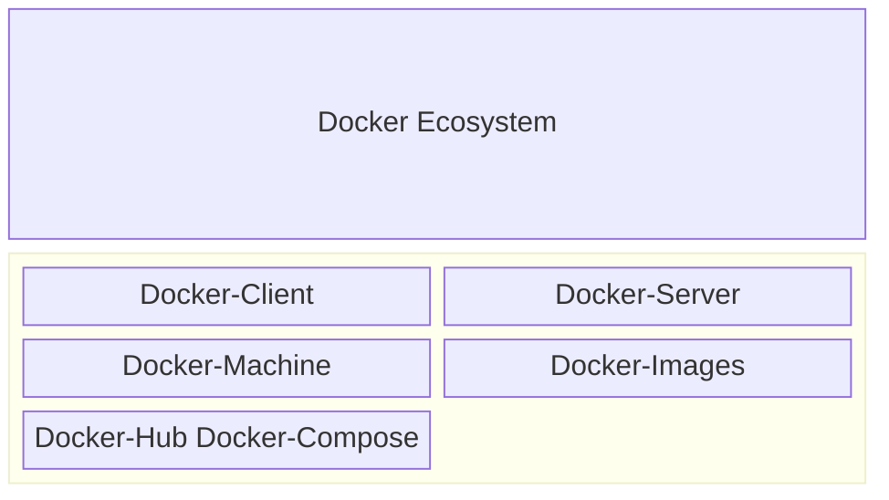
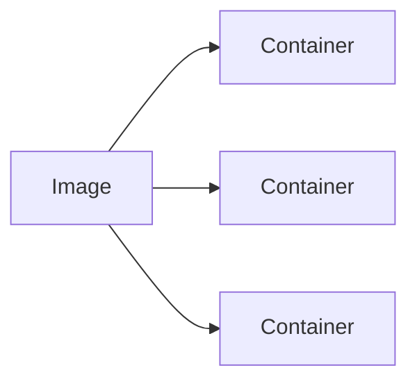
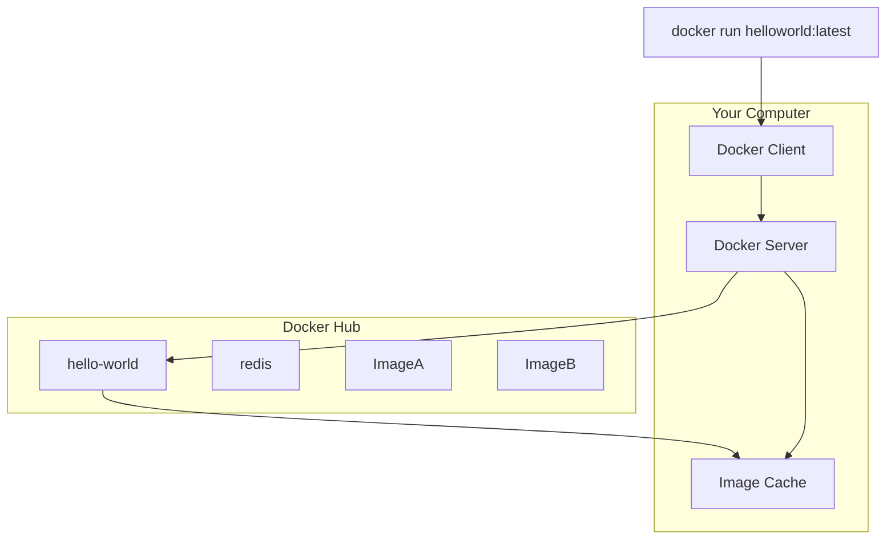

# Overview

## Docker Ecosystem

## What is Docker
Docker is an open-source platform that enables developers to build, deploy, run,
and manage applications using containers.
Image is a file to collect the dependencies and config required to run a program

Container is an instance of an image to run a program.

## Docker Run Hello World

